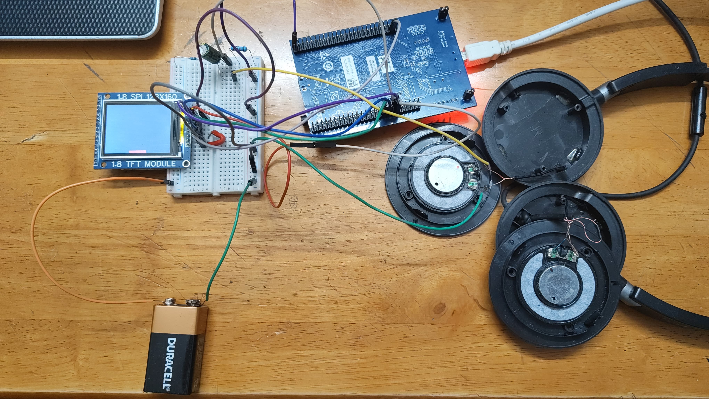

# 🎧 Headphones Audio Visualizer – STM32 Bare-Metal Project

This project turns a regular pair of headphones into a **visual audio experience** by displaying a real-time **VU meter** or **waveform** on a **1.8" ST7735 TFT screen**, powered by an STM32F407G-DISC1 board.

## ✨ Features

- 📊 VU Meter for audio signal amplitude
- 🌊 Real-time waveform display (oscilloscope-like)
- ⚙️ Written **entirely in bare-metal C** — no HAL, no RTOS
- 🎨 ST7735 1.8" TFT rendering via SPI
- 🎧 Audio sampled from headphone output
- ⏱️ Real-time ADC sampling

## 📷 Photos

  

## 🧠 Why Bare Metal?

This project uses **bare-metal programming** with **direct register access**, offering:
- Total control over STM32F4 peripherals
- No bloat from HAL or CMSIS
- A learning opportunity to work with SPI, ADC, TIM, and GPIO directly
- More efficient and predictable firmware

## 🔧 Hardware Setup

- **MCU**: STM32F407G-DISC1  
- **Display**: 1.8" ST7735 TFT (SPI interface)  
- **Audio Input**: Headphone signal (AC-coupled + biased)  
- **Power Supply**: USB 5V from ST-Link or external  
- **Optional Components**: Op-amp or biasing circuit for signal conditioning

### 🎚️ Audio Interface (Simplified)

Headphone → [AC Coupling] → [Voltage Divider + Biasing] → ADC Pin (STM32)

The audio signal is biased to sit within 0–3.3V for STM32’s ADC.

## 🧰 Tools Used

- `arm-none-eabi-gcc` toolchain
- `st-link` for flashing
- `make` for building (Makefile-based workflow)
- Logic analyzer / oscilloscope (for debugging signal levels)

## 🚧 Future Work
- Implement FFT-based frequency bands
- Display mode switch via button
